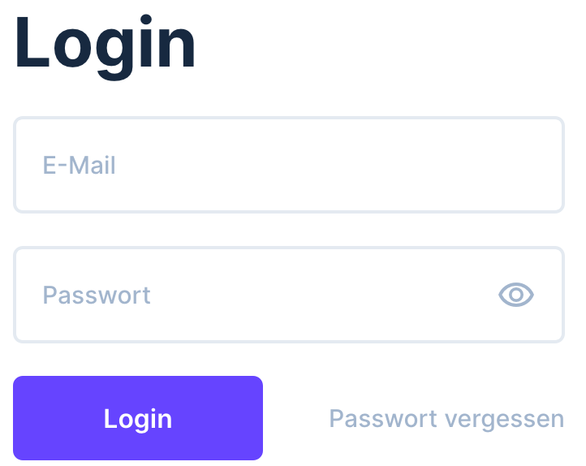
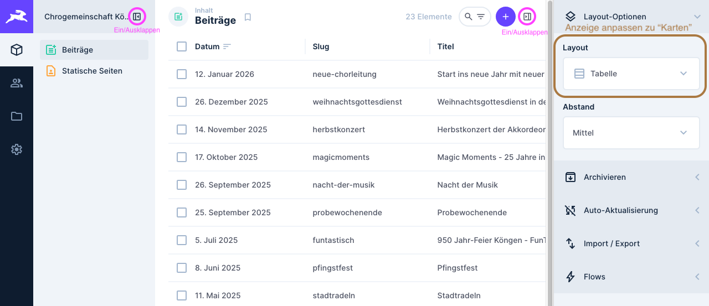
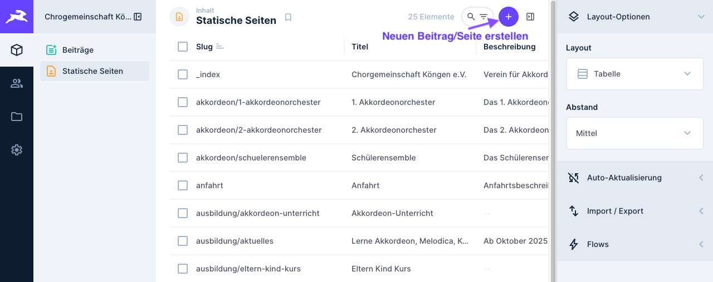
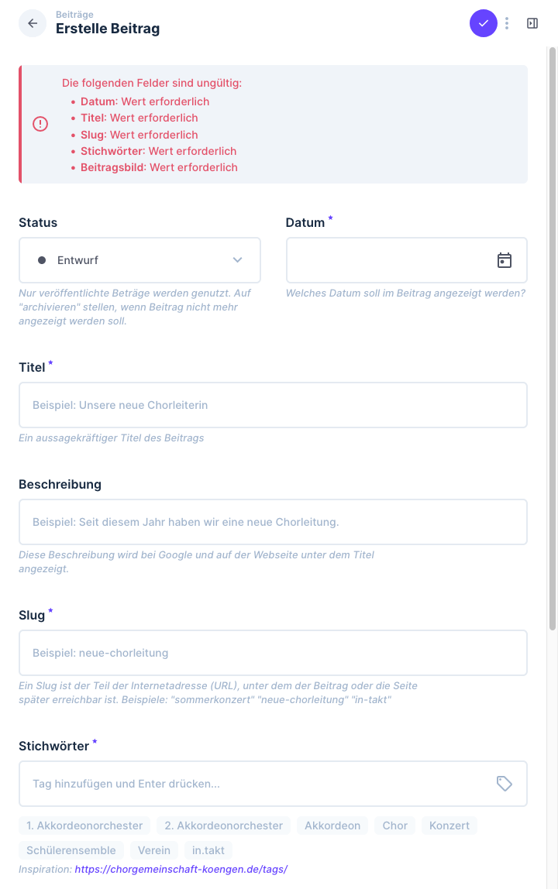
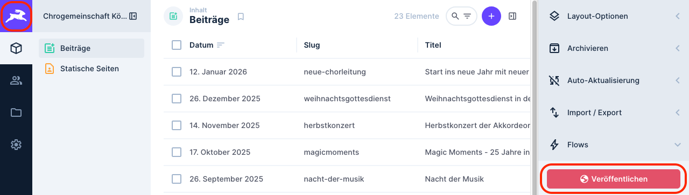
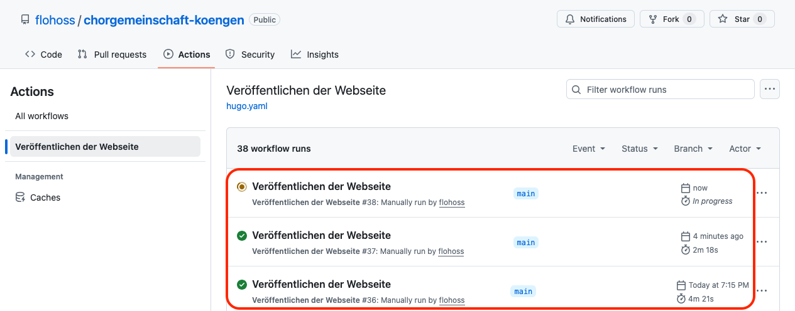

# Chorgemeinschaft Köngen - Website

Dies ist für die Website der [Chorgemeinschaft Köngen](https://www.chorgemeinschaft-koengen.de).

## Verwaltungstool

Alle Inhalte sind unter [chorgemeinschaft.fhoss.de](https://chorgemeinschaft.fhoss.de) zum Bearbeiten.

### Was ist ein Verwaltungstool?

Das Verwaltungstool ist ein einfaches System, mit dem man die Inhalte der Website bearbeiten kann - ganz ohne Programmierkenntnisse.

**Was können Sie damit machen?**

- Neue Beiträge schreiben und veröffentlichen
- Texte und Bilder bearbeiten
- Bestehende Seiten aktualisieren
- Inhalte archivieren

**Wie funktioniert es?**
Man meldet sich einfach mit Zugangsdaten an und kann dann eine übersichtliche Oberfläche mit allen Inhalten der Website. Dort kann man direkt in den Feldern schreiben, Bilder hochladen und Änderungen speichern. Die Änderungen werden nach dem Veröffentlichen dann automatisch auf der echten Website sichtbar.

## Anmelden

Mit Zugangsdaten [hier](https://chorgemeinschaft.fhoss.de/admin/login) mit E-Mail und Passwort anmelden.

## Navigation - Menüpunkte

### Beiträge (Posts)

### Seiten (Pages)

### Neuer Beitrag/Seite anlegen

Zum Anlegen eines neuen Beitrags oder einer Seite auf die entsprechende Kategorie klicken und dann "Element erstellen" klicken.

Alle Pflichtfelder (mit \* markiert) ausfüllen und auf "Speichern" klicken.
Jedes Feld hat eine kleine Erklärung, was dort eingetragen werden soll.

## Veröffentlichen

Wenn man einen Beitrag oder eine Seite fertig bearbeitet hat, muss dieser noch veröffentlicht werden.
Dazu auf den Button "Veröffentlichen" klicken.

Nun kann man mit klick auf den Hasen oben links direkt auf die Übersichtsseite gelangen auf denen die aktuellen und vergangenen Veröffentlichungs-Prozesse angezeigt werden.
Wenn diese Erfolgreich waren, ist ein grüner Haken zu sehen.
Dann sollte die [Webseite](https://www.chorgemeinschaft-koengen.de) die Änderungen anzeigen.

