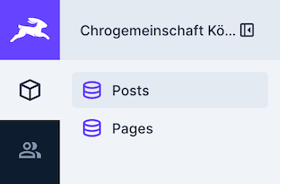
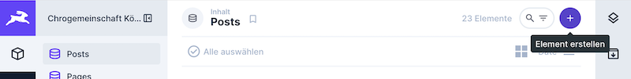
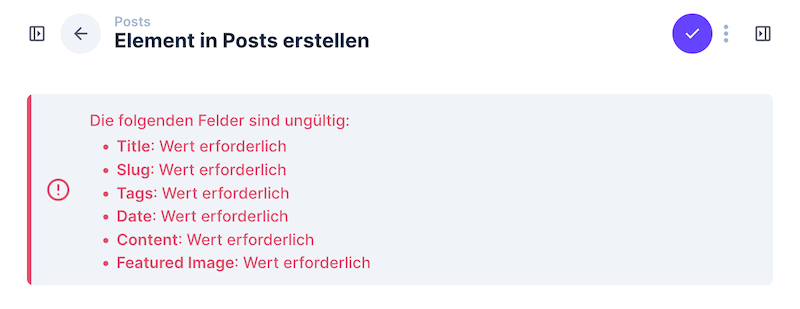

# Chorgemeinschaft Köngen - Website

Dies ist für die Website der [Chorgemeinschaft Köngen](https://www.chorgemeinschaft-koengen.de).

## Verwaltungstool

Alle Inhalte sind unter [chorgemeinschaft.fhoss.de](https://chorgemeinschaft.fhoss.de) zum bearbeiten.

## Login

Mit Zugangsdaten [hier](https://chorgemeinschaft.fhoss.de/admin/login) anmelden.

## Navigation - Menüpunkte

Posts sind Beiträge, die mit Bild unter "Alle Beiträge" veröffentlicht werden.

Pages sind statische Seiten, die im Menü der Website verlinkt sind.

## Posts - Beiträge

Beiträge (Posts) sind später auf der Seite unter [https://chorgemeinschaft-koengen.de/posts/](https://chorgemeinschaft-koengen.de/posts/) zu finden.

### Neuer Beitrag

Zum Anlegen eines neuen Beitrags auf "Posts" und dann "Element erstellen" klicken.

Danach alle Pflichtfelder ausfüllen (Diese werden mit Sternchen gekennzeichnet und werden vom System überprüft):

Eine Erklärung jedes Feldes steht direkt unter dem Eingabefeld.
